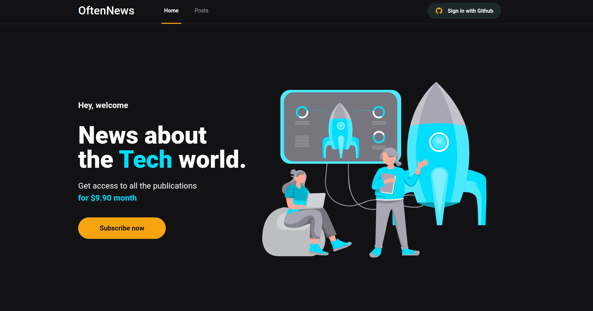

# Oftennews

É um projeto inspirado no ignews da Rocketseat para cadastro e inscrição para receber notícias e publicações, modificados como eu achei necessário e interessante.
E além disso, usando uma API chamada stripe que permite pagamentos por cartão de crédito principalmente.

Usei tecnologias como SSR (Server-side Rendering) e SSG (Static Site Generation)


### Rodar projeto

```
$npm install next react react-dom
$yarn dev
```
### Cores prontas

[https://chakra-ui.com/docs/styled-system/theme](https://chakra-ui.com/docs/styled-system/theme)

### Ilustrações

https://freesvgillustration.com/ 

### A página inicial

